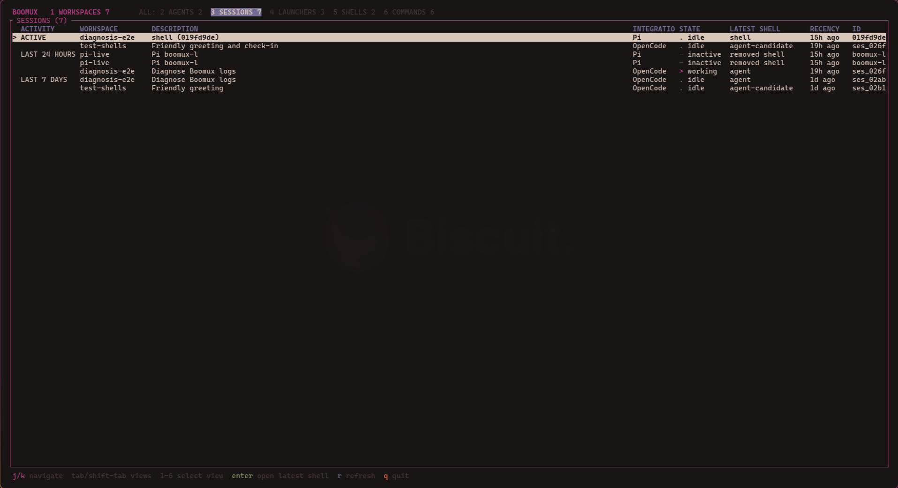

# Boomux

<p align="center">
  
</p>

> [!WARNING]
> Boomux is an early proof of concept. Commands, storage, and session behavior
> may change without migration support.

Boomux keeps shells alive in a small background daemon, groups them into durable
workspaces, and tracks external agent lifecycle and session history. Each shell
still opens in an ordinary native terminal window whose emulator owns rendering,
fonts, selection, clipboard behavior, and window chrome. Boomux owns the PTY,
process lifetime, workspace grouping, attachment transport, and durable runtime
metadata.

## Usage

Create a shell whose working directory is the requested path and attach in
place. When no workspace name is supplied, Boomux creates the next available
`workspace-N` container automatically:

```console
boomux .
```

Each unnamed invocation creates a new generated workspace. A workspace is a
named container with a UUID; each shell and launcher independently owns its
working directory. Use `--name` to add the shell to an existing named workspace
or create that explicitly named container:

```console
boomux . --name feature-x
```

Run a command instead of the login shell by placing its exact arguments
after `--`:

```console
boomux . -- cargo watch -x test
boomux . --name feature-x --new -- lazygit
```

Boomux executes the command directly without shell parsing. Use an explicit
shell such as `sh -lc` when pipelines, redirects, or variable expansion are
required. The dashboard labels this durable slot as `command`; the exact command
is its primary process, so interrupting or exiting it ends the run and closes the
attached terminal. A `shell` row instead starts a login shell, where `Ctrl-C`
normally interrupts a child program and returns to the prompt.

Open the shell in Omarchy's selected terminal instead of attaching in place:

```console
boomux . --new
boomux . --terminal Alacritty.desktop
```

`--terminal` implies `--new`. Selection precedence is the CLI override, Boomux
configuration, then Omarchy's default terminal.

Run Boomux without a path to open the Ratatui dashboard:

```console
boomux
```

The explicit dashboard command remains available as an alias:

```console
boomux ui
```

Dashboard controls:

- `Tab` and `Shift-Tab` cycle the Workspaces, Agents, Sessions, Launchers,
  Shells, and Commands views. Number keys `1` through `6` select them directly.
- In the primary Workspaces view, `h`, `l`, and the left/right arrows switch
  between the workspace and item tables.
- `j`, `k`, and the arrow keys navigate.
- `Enter` restores a workspace, opens a shell, invokes a launcher, or opens the
  newest still-existing shell associated with a selected session.
- `a` creates an empty workspace or adds a shell, depending on the focused
  table in the Workspaces view. New dashboard shells start in the directory
  where the dashboard was launched.
- `e` renames the selected workspace, shell, or launcher.
- `x`, then `y`, closes the selected workspace or shell, or removes the selected
  launcher.
- `r` refreshes immediately.
- `q` or `Esc` quits.

Workspaces remain the primary dashboard view. The selected workspace's item
table identifies login shells, PTY-backed exact commands, agent shells, and
configured launchers in a `KIND` column. The secondary `ALL:` views aggregate
each kind across every workspace while retaining the owning workspace and exact
item actions. Counts are exclusive by visible presentation: an agent row is not
also counted as a shell or command.

When an active Agent instance is bound to a shell's current run, that shell row
morphs into an agent row instead of adding a duplicate item. It keeps the
shell's name, ID, directory, and open, rename, and close actions while showing the
Agent's lifecycle state and evidence. The Agents view stays focused on those
current presentations. The Sessions view independently retains Boomux-observed
active and historical sessions, grouped by activity window with workspace,
integration, state, host-provided description, associated shell, recency, and
canonical identity. A foreground `opencode` or `pi` process also supplies a
presentation-only agent hint while the lifecycle integration establishes a
durable Agent session.

<p align="center">
  
</p>

Closing a terminal window only disconnects its attachment. The Boomux daemon
retains the PTY and child process until the shell exits, the workspace is
closed, or the daemon stops.

## Commands

```console
boomux ui
boomux doctor
boomux capabilities [--json]
boomux list
boomux shells
boomux read <shell-name-or-shell-id> [--lines <count>]
boomux events [--after <cursor>] [--limit <count>] [--wait-ms <milliseconds>]
boomux close <shell-name-or-shell-id>
boomux open <shell-id> [--title <title>] [--takeover]
boomux workspace list
boomux workspace create <name>
boomux workspace open <name-or-id>
boomux workspace inspect <name-or-id>
boomux workspace rename <name-or-id> <new-name>
boomux workspace close <name-or-id>
boomux shell create <workspace-name-or-id> [--name <name>] [--cwd <path>] [-- <command>...]
boomux shell inspect <shell-name-or-id> [--workspace <name-or-id>]
boomux shell rename <shell-name-or-id> <new-name> [--workspace <name-or-id>]
boomux shell close <shell-name-or-id> [--workspace <name-or-id>]
boomux launcher list --workspace <name-or-id>
boomux launcher create <name> --workspace <name-or-id> [--cwd <path>] -- <command>...
boomux launcher inspect <launcher-name-or-id> [--workspace <name-or-id>]
boomux launcher rename <launcher-name-or-id> <new-name> [--workspace <name-or-id>]
boomux launcher remove <launcher-name-or-id> [--workspace <name-or-id>]
boomux agent list [--workspace <name-or-id>]
boomux agent inspect <agent-id>
boomux agent wait <agent-id> --after-revision <revision> [--wait-ms <milliseconds>]
boomux agent register <name> --integration <integration> [--external-session-id <id>] [--shell-id <shell-id>] [--run-id <run-id>] --state <state> --authority <authority> --evidence <evidence> --confidence <0-100>
boomux agent ensure <name> --integration <integration> --external-session-id <id> [--shell-id <shell-id>] [--run-id <run-id>] --state <state> --authority <authority> --evidence <evidence> --confidence <0-100>
boomux agent supervise <name> --integration <integration> --external-session-id <canonical-root-id> [--shell-id <shell-id>] [--run-id <run-id>] -- <command>...
boomux agent report <agent-id> [--shell-id <shell-id>] [--run-id <run-id>] --state <state> --authority <authority> --evidence <evidence> --confidence <0-100>
boomux attention list [--workspace <name-or-id>]
boomux attention acknowledge <agent-id> --observation-revision <revision>
boomux session list [--workspace <name-or-id>]
boomux session inspect <session-id>
boomux session read <session-id> [--before <cursor>] [--limit <entries>] [--max-bytes <bytes>]
boomux daemon status
boomux daemon restart
boomux daemon stop
boomux skill install [--force]
boomux opencode install [--force]
boomux pi install [--force]
```

`boomux shells` lists shells in the current workspace. `boomux read` and
`boomux close` resolve shell names within that workspace; exact shell IDs work
from anywhere. A shell cannot close itself through the CLI.

The `workspace` and `shell` command groups expose explicit lifecycle operations
for scripts and integrations. `shell create` records a pending shell; its PTY
and process start when the shell is first opened. Shell names require current
workspace context or `--workspace`; IDs remain globally addressable.
Explicitly opening an exited shell, including through dashboard `Enter` or
`workspace open`, starts its stored command as a new run on the same durable
shell identity. Retained output remains readable until that reopen.
New workspace and shell names are limited to 256 UTF-8 bytes so retained event
payloads remain bounded. Existing persisted names remain loadable.

Workspace launchers are durable commands that run on every explicit workspace
open, including dashboard `Enter` and `boomux workspace open`. They are detached
client-side processes without PTYs, retained output, or shell-run history. A
launcher-only workspace is valid. Commands are exact argument vectors, `--cwd`
defaults to the current directory, and multiple launchers run in creation order
before terminal windows open:

```console
boomux workspace create boomux
boomux launcher create editor --workspace boomux --cwd . -- zeditor .
boomux launcher create browser --workspace boomux -- firefox http://localhost:3000
boomux workspace open boomux
```

Opening continues after individual launcher or terminal spawn failures and
reports all failures at the end. Removing a launcher affects future opens only;
Boomux does not track or terminate applications it previously launched.

Protocol 11 adds the explicit exited-shell restart used by open and restore.
Low-level attachment can still inspect a completed run without restarting it.

Agent instances are durable records for external agent sessions. Each instance
has its own exact ID and is bound to exactly one shell run, not merely to a
durable shell. Protocol 10 adds `agent ensure`, an idempotent registration keyed
by integration, external session ID, shell ID, and run ID. It requires
`--external-session-id`; an existing match is returned unchanged, including
after an integration or daemon reload, while a different shell run creates a
different identity. `register`, `ensure`, and `report` require explicit
`unknown`, `working`, `blocked`, `idle`, `inactive`, or `done` state plus authority,
evidence, and confidence.

External reports use this precedence: `lifecycle-integration` over
`process-adapter` over `terminal-heuristic`. A lower-authority report is a
successful no-op. At equal authority, an exact duplicate is a no-op, while any
changed state, evidence, or confidence replaces the observation and increments
its revision. `daemon-lifecycle` exists in snapshots but is reserved for daemon
observations and cannot be supplied to public mutation commands. A `done` report
completes the instance permanently. Retrying the exact completion is an
idempotent success; a different later report is rejected. Completed instances
remain inspectable across daemon restart. Protocol 14 adds `agent wait`: callers
supply the last observed revision and can block until a newer durable observation
is accepted without polling. Protocol 15 records accepted blocked and completed
observations in a durable, blocked-first attention queue. Each item retains the
exact raising evidence, authority, confidence, revision, and timestamp until it
is conditionally acknowledged; later working or idle activity does not erase
unseen work. Workspace output includes fixed Agent state counts and the
outstanding attention count. Boomux does not yet provide terminal heuristics,
agent reads, or agent control.

Optional desktop notifications mirror transitions into `blocked` and `done`.
They do not replace or acknowledge durable attention items. Delivery is an
asynchronous, at-most-once attempt after the Agent mutation commits, and failures
never fail the Agent request. A bounded delivery queue prevents notification
bursts from exhausting daemon resources. Boomux does not replay restored
attention after a daemon start or handoff, and changed evidence for an already
blocked Agent does not generate another notification until the Agent first
leaves that state.

`boomux session list` and `boomux session inspect` project durable Agent
instances into workspace session history. Instances are grouped within one
workspace and integration by external session ID; records without one remain
isolated. A session is current only while at least one occurrence is active on
the exact current run of a running retained shell. Otherwise its state is
explicitly last-known. The CLI `description` is the latest stored Boomux Agent
registration name. The dashboard may separately enrich its display title from
bounded host catalogs; the CLI never synchronously calls those adapters.

Projected session IDs are deterministic, globally unique UUIDs, but are opaque.
Obtain an ID from `session list` and pass that exact value to `session inspect`
or `session read`;
never guess one from an external session ID, description, shell, or Agent ID.
Session projection is client-side metadata over daemon protocol 12 snapshots,
not another persisted daemon entity.

Protocol 13 captures each Agent instance's working directory from its exact
bound shell at registration. Projected occurrences expose this as `source_cwd`,
so canonical transcript lookup can survive shell removal and daemon restart.
The underlying directory and harness transcript data must still exist.

`session read` loads canonical host data for OpenCode and Pi, never terminal
scrollback. It returns the newest bounded suffix of messages, reasoning, and tool
activity in chronological order. Pi reads only the current leaf branch and
combines tool calls with their results. Boomux does not redact host content;
`--limit` and `--max-bytes` explicitly bound the response and report truncation.
When `has_more` is true, pass the opaque `next_cursor` back through `--before`
to read older entries. Cursors preserve the initial normalized snapshot across
appends that leave its normalized prefix unchanged, and expire if existing
entries, the active Pi branch, source context, or adapter normalization changes.
Transcript hosts are registered behind one adapter contract, so future harnesses
such as Claude Code or Codex can supply canonical lookup and normalization while
reusing exact Boomux identity, bounds, errors, and output semantics. Discover the
currently bundled adapters through `session_transcript_integrations` in
`boomux capabilities --json`.

The first explicit process-adapter supervisor runs one exact argument vector:

```console
boomux agent supervise Agent --integration example --external-session-id <canonical-root-id> -- agent-bin --flag
```

`--shell-id` and `--run-id` have the same managed-environment defaults as the
other agent mutations. The command is executed directly, without shell parsing,
and inherits stdin, stdout, and stderr. The supervisor propagates a normal child
exit code and maps signal termination to `128 + signal`. It ensures the exact
integration, external session ID, shell ID, and run ID key, then reports process
start and exit evidence at state `unknown`, authority `process-adapter`, and
confidence 100. Exit evidence includes the child PID and exit code or signal.
Process existence provides no basis for `done`, `working`, `blocked`, or `idle`,
so the supervisor never infers those states.

Reporting is fail-open: ensure or report failures emit a warning but do not stop
the child or replace its exit status. A spawn or wait failure is still a
supervisor command failure. Lifecycle-integration observations outrank these
process-adapter observations and therefore remain unchanged. Identity matching
uses the complete exact key: a supervisor using the lifecycle integration's
same key contributes to that instance, while a different integration, external
session ID, shell ID, or run ID coexists as a distinct instance.

`boomux read` reads plain rendered text from the daemon's shadow VT state. It
understands cursor rewrites and terminal soft wrapping, retains up to 2,000
scrollback rows per shell, and never returns ANSI control sequences.

Read-only integration commands, including `agent list`, `agent inspect`,
`session list`, `session inspect`, and `session read` accept `--json` and emit the stable
`boomux.cli/v1` envelope. Run `boomux capabilities --json` to discover supported
commands, features, and typed error codes without starting the daemon. See
[`docs/cli-json.md`](docs/cli-json.md) for the contract.
Daemon events and revision-aware reads are documented in
[`docs/event-stream.md`](docs/event-stream.md).

## Configuration

Boomux loads `$XDG_CONFIG_HOME/boomux/config.toml`, falling back to
`~/.config/boomux/config.toml`. `BOOMUX_CONFIG` can provide a final overlay.

```toml
terminal = "Alacritty.desktop"

[projects]
roots = ["~/Projects", "~/Work"]
max_depth = 3

[notifications]
enabled = false
blocked = true
completed = true
```

Notifications are disabled by default and require `notify-send` plus a desktop
notification service. The daemon samples this configuration at startup; run
`boomux daemon restart` after changing it. `boomux doctor` reports whether the
configured command and a plausible desktop bus environment are present. Bodies
contain only the sanitized Agent, workspace, and shell names, never evidence,
working directories, command arguments, external session IDs, or transcript
content.

Directory discovery scans only configured project roots, recognizes ordinary
and linked Git worktrees, and stops descending after finding a repository. The
dashboard uses discovered projects only as quick suggestions for workspace
names. Selecting one does not store or associate its path. Arbitrary text can
also be entered as a workspace name, and every newly created workspace starts
empty.

## Shell Context

Managed processes receive:

```text
BOOMUX_WORKSPACE_ID
BOOMUX_WORKSPACE
BOOMUX_SHELL_ID
BOOMUX_SHELL_NAME
BOOMUX_RUN_ID
```

Workspace launcher invocations instead receive `BOOMUX_WORKSPACE_ID`,
`BOOMUX_WORKSPACE`, `BOOMUX_LAUNCHER_ID`, and `BOOMUX_LAUNCHER_NAME`. They
inherit the invoking client's desktop environment, while shell/run context is
removed.

Workspace and shell IDs remain authoritative after a rename. `BOOMUX_RUN_ID`
identifies one process incarnation and changes when a durable shell starts a
new process after recovery. A live process transferred from a pre-run-identity
daemon receives a daemon-side run identity, but its existing environment cannot
be retrofitted; `shell inspect` reports that compatibility case as
`environment_has_run_id: false`. Agent `register`, `ensure`, and `report` default their
shell and run arguments from `BOOMUX_SHELL_ID` and `BOOMUX_RUN_ID`.
Integrations outside that exact environment must pass both IDs and must not
guess a run from shell status or retained output. A dynamic
Starship segment can call the hidden prompt command:

```toml
[custom.boomux]
command = "boomux prompt"
when = 'test -n "$BOOMUX_SHELL_ID"'
format = '[ 󰊠](bg:blue fg:yellow)[ $output](bg:blue fg:crust)'
```

## Agent Skill

Install the optional vendor-neutral [Agent Skill](https://agentskills.io) with:

```console
boomux skill install
```

It is written to `~/.agents/skills/boomux/SKILL.md` and teaches compatible
agents to discover, inspect, read, create, open, rename, and close Boomux
workspaces and shells, and to inspect and explicitly report run-scoped agent
lifecycle or supervise a process with caller-supplied exact identity, through
the full public CLI. Re-run with `--force` to replace an older customized
installation. An untouched legacy `boomux-shells` skill is removed
automatically; customized legacy content is preserved with a warning.

## Integration Compatibility

Boomux currently validates its bundled integrations against these host releases:

| Integration | Package | Validated version |
| --- | --- | --- |
| OpenCode | `opencode-ai` | `1.18.15` |
| Pi | `@earendil-works/pi-coding-agent` | `0.84.1` |

These versions are compatibility test points, not runtime pins. Older or newer
releases may work when their plugin APIs remain compatible, but are not claimed
as supported until validated. `boomux capabilities --json` exposes the same
matrix under `integration_hosts`.
The scope and evidence behind each test point, including transitions that still
require an authenticated disposable provider, are recorded in
[`docs/lifecycle-validation.md`](docs/lifecycle-validation.md).

## OpenCode Integration

Install the bundled config-time OpenCode lifecycle plugin with:

```console
boomux opencode install
```

The destination is `$XDG_CONFIG_HOME/opencode/plugins/boomux.js`, or
`~/.config/opencode/plugins/boomux.js` when `XDG_CONFIG_HOME` is unset. OpenCode
discovers files in that global plugin directory automatically; the installer
does not edit `opencode.json` or other plugins. An identical file is left
unchanged. Different content requires `--force`, and detected symlinked or
non-regular path components and targets are rejected even with `--force`. Because OpenCode
loads config-time plugins at startup, quit and restart OpenCode after installing
or replacing the plugin.

Inside a Boomux-managed shell, the plugin groups each root OpenCode session and
all child/subagent sessions into one durable agent instance keyed by the root
session ID. OpenCode status, chat, tool, compaction, permission/question, error,
idle, and deletion events produce explainable `working`, `blocked`, `idle`, and
`done` observations. Child activity contributes to the root; only root idle can
make it idle, and only explicit deletion of the root reports `done`. Process or
shell exit does not report completion.

The plugin is fail-open: outside a managed Boomux run, when Boomux is
unavailable, or when OpenCode session ancestry cannot be resolved, OpenCode
continues and reporting errors are rate-limited. A `run_changed` response
permanently disables reports for that tracked root so events cannot leak into
another process run.

Do not use automatic OpenCode process discovery to supply `agent supervise`.
OpenCode process identity, argv, database state, and API access do not identify
which canonical root session the user selected. Fresh sessions, continue, fork,
and in-process session switching are unsupported by this supervisor unless the
caller already has the selected canonical root ID and passes it explicitly as
`--external-session-id`. This is not a reason to wrap ordinary OpenCode launches
when the lifecycle plugin is available: the plugin resolves canonical ancestry
and provides stronger, meaningful lifecycle observations.

## Pi Integration

Install the bundled global Pi lifecycle extension with:

```console
boomux pi install
```

The destination is `$PI_CODING_AGENT_DIR/extensions/boomux.js`, or
`~/.pi/agent/extensions/boomux.js` when that environment variable is unset. Pi
discovers the extension automatically. Identical content is left unchanged;
different content requires `--force`, and symlinked or non-regular install paths
are rejected. Restart Pi after installing or replacing the extension.

Inside a Boomux-managed shell, the extension uses Pi's canonical project session
ID and lifecycle hooks. Session start reports `idle`, agent start reports
`working`, and `agent_end` records a final assistant error when present.
`agent_settled` reports that terminal error as `blocked`, or `idle` only after
retries, compaction, and queued continuations have finished. A new agent run
clears the latched error. Session shutdown reports `inactive` rather than
permanent completion because Pi sessions are resumable. Inactive instances
remain durable but do not occupy agent rows until the session starts again.
Calls use exact argument vectors, bounded JSON output, and fail open when Boomux
is unavailable. Session shutdown retries its `inactive` report once after a
transient failure.

## Architecture

```text
Ghostty, Alacritty, or another XDG terminal
  -> boomux __attach <shell-id>
  -> $XDG_RUNTIME_DIR/boomux/daemon.sock
  -> boomux daemon
  -> PTY
  -> shell or application
```

Live PTY bytes pass through unchanged. The attachment client only enables raw
mode, forwards input and resize events, writes output, and restores terminal
mode on exit. See [`docs/architecture.md`](docs/architecture.md) for details.
Shells remain pending until their first attachment reports terminal environment
and dimensions; that profile initializes the PTY and child process. Reproducible
workspace and shell metadata provides crash recovery, while a graceful
`boomux daemon restart` transfers running shells, preserves exited shells and
their final terminal state, and reconnects active clients.
See [`docs/live-pty-handoff.md`](docs/live-pty-handoff.md) for the handoff design.

## POC Limitations

- Live daemon restart preserves pending, running, and exited shells. Active
  attachment clients reconnect cooperatively, while exited shells retain their
  run metadata and bounded final terminal state without starting a new process.
- An unexpected daemon exit cannot hand off live PTYs. Persisted shell metadata
  returns as pending and starts fresh processes when reopened.
- Mutated process environment and in-memory application state are not persisted.
- Reconnection emits at most 1 MiB of sanitized VT reconstruction rather than
  replaying historical PTY bytes. Graphics are omitted from reconstruction.
- Alternate-screen applications restore their current screen, but not their
  alternate-screen history.
- One writable controller is supported per shell; takeover replaces it.
- Slow controllers can lose live output chunks rather than block the child.
- A running shell keeps its first attachment's terminal environment. A later
  attachment with a different `TERM` receives a compatibility warning.
- The native backend currently targets Unix/Linux and Omarchy.

## Development

```console
cargo run -- .
cargo run -- . --new
cargo run -- ui
cargo run -- doctor
cargo test
cargo clippy --all-targets -- -D warnings
```

Install the optimized binary with:

```console
cargo install --path . --root ~/.local --force
```

The daemon auto-starts on the first command that needs it. During development,
run `boomux daemon stop` before testing a rebuilt binary because both may use
the same protocol version while containing different code. Stopping the daemon
also terminates every shell it owns.

## Roadmap

See [`docs/roadmap.md`](docs/roadmap.md).
