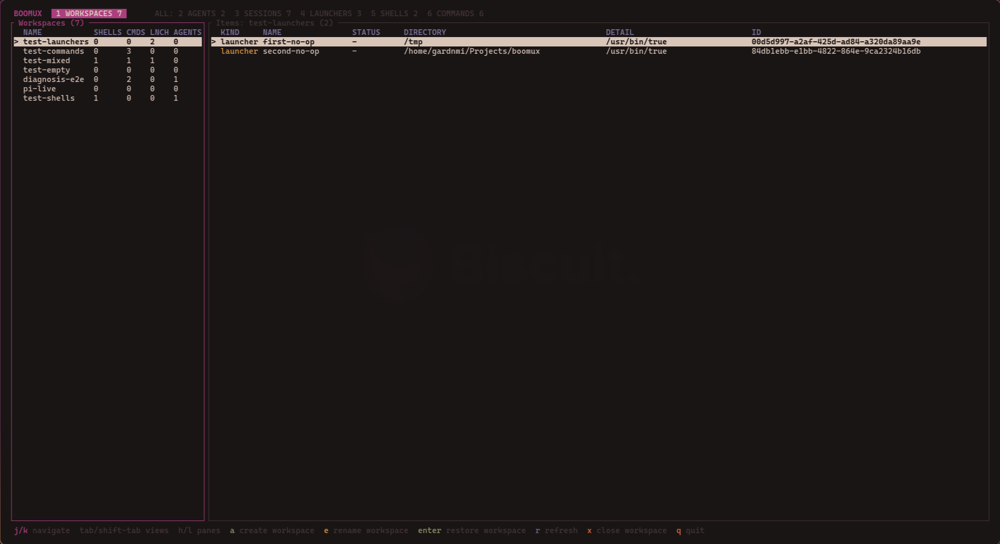
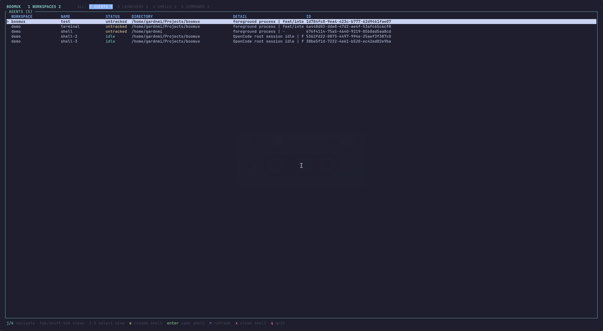

# Boomux

**Persistent workspaces for native terminal windows.**

Boomux keeps shells and commands running after their terminal windows close. It
groups related work into named workspaces that you can reopen from a dashboard,
while continuing to use Ghostty, Alacritty, or another XDG terminal as ordinary
native windows.

Optional integrations show whether supported coding agents are working, blocked,
idle, or untracked without trying to infer state from quiet terminal output.



> [!WARNING]
> Boomux is an early proof of concept. Commands, storage, and session behavior
> may change without migration support.

## Install

Boomux currently targets Unix/Linux desktop sessions. It is primarily tested on
Omarchy, but Omarchy is not required.

At runtime, Boomux requires:

- An absolute `XDG_RUNTIME_DIR`.
- `xdg-terminal-exec` and an available terminal desktop entry.
- `git` for repository metadata.

Installing from source also requires:

- A Rust toolchain.

Download and install the latest Linux x86_64 release with the GitHub CLI:

```console
version=$(gh release view --repo gardnmi/boomux --json tagName --jq .tagName)
gh release download "$version" --repo gardnmi/boomux --pattern "boomux-$version-x86_64-unknown-linux-gnu.tar.gz*"
sha256sum --check "boomux-$version-x86_64-unknown-linux-gnu.tar.gz.sha256"
tar -xzf "boomux-$version-x86_64-unknown-linux-gnu.tar.gz"
install -Dm755 "boomux-$version-x86_64-unknown-linux-gnu/boomux" ~/.local/bin/boomux
boomux doctor
```

Alternatively, install directly from the repository with a Rust toolchain:

```console
cargo install --git https://github.com/gardnmi/boomux --locked
boomux doctor
```

`boomux doctor` checks required runtime dependencies plus optional notification
and coding-agent integrations. An optional integration warning does not prevent
ordinary workspace and shell use.

## Quick Start

From a regular terminal in a project directory, create a named workspace and
its first managed shell:

```console
boomux . --name my-project
```

`.` selects the current directory. Boomux creates the workspace and shell, then
connects the current terminal window to that shell. The directory becomes the
workspace default for shells created without an explicit working directory;
individual shells can still use other directories.

Start a program, then close the terminal window. The process keeps running. From
a fresh, regular terminal, open the dashboard:

```console
boomux
```

Focus the workspace table, select `my-project`, and press `Enter` to open its
shells and launchers. To connect only one existing shell, focus the entry table,
select that shell, and press `Enter`.

To add another managed shell, either focus the workspace's entry table and
press `a`, or run this from a regular terminal:

```console
boomux . --name my-project --new
```

Boomux rejects path-opening shorthand such as `boomux .` inside a managed shell
to avoid nesting managed sessions. Use the dashboard or a fresh terminal to add
or open another shell.

Run one command instead of a login shell by placing its arguments after `--`:

```console
boomux . --name my-project --new -- cargo watch -x test
```

Boomux executes those arguments directly. Use an explicit shell only when you
need shell syntax:

```console
boomux . --name my-project --new -- sh -lc 'cargo test | tee test.log'
```

## Core Concepts

| Concept | Meaning |
| --- | --- |
| **Workspace** | A named group of managed shells, commands, and launchers. |
| **Managed shell** | A persistent terminal session, usually running your login shell. |
| **Command** | A managed terminal session that runs one command instead of a login shell. |
| **Launcher** | A desktop command run when its workspace opens. Boomux does not retain its output or process. |
| **Agent schedule** | A durable workspace-owned recurring Agent prompt. New schedules are paused until explicitly enabled. |

### What Keeps Running

| Action | Result |
| --- | --- |
| Close a terminal window | The managed process keeps running. |
| Quit the dashboard | All managed processes keep running. |
| Close a shell in Boomux | That shell's process is terminated. |
| Close a workspace in Boomux | Its shells are terminated; schedules, persisted prompts, and workspace metadata are removed. |
| Run `boomux daemon restart` | Live shells are handed to the replacement daemon. |
| System reboot or unexpected daemon loss | Live processes are lost; workspace and shell definitions remain, and reopening them starts new processes. |

## Common Workflows

| Goal | Command |
| --- | --- |
| Create a generated workspace | `boomux .` |
| Create or add to a named workspace | `boomux . --name feature-x` |
| Create an empty workspace with a default directory | `boomux workspace create feature-x --cwd .` |
| Add a randomly named shell | `boomux shell create feature-x` |
| Open the new shell in another terminal | `boomux . --name feature-x --new` |
| Run one command | `boomux . --name feature-x --new -- lazygit` |
| Choose a terminal | `boomux . --terminal Alacritty.desktop` |
| Open the dashboard | `boomux` or `boomux ui` |
| Inspect daemon health | `boomux doctor` |
| List recurring Agent work | `boomux schedule list --workspace feature-x` |

Without `--name`, Boomux creates the next `workspace-N` and stores the selected
path as its default for later shells. With `--name`, it adds a shell to an
existing exact-name workspace or creates a workspace with that default.
Shells created without an explicit shell name receive a memorable lowercase
`adjective-noun` name such as `quiet-otter`; that concrete name is retained like
any explicit name.
`--terminal` implies `--new`. Terminal selection uses the CLI override, then
Boomux configuration, then the normal `xdg-terminal-exec` policy.

### Workspace Launchers

Launchers are useful for applications that should open with a workspace but do
not need a retained terminal:

```console
boomux workspace create boomux
boomux launcher create editor --workspace boomux --cwd . -- zeditor .
boomux launcher create browser --workspace boomux -- firefox http://localhost:3000
boomux launcher invoke editor --workspace boomux
boomux workspace open boomux
```

Removing a launcher affects future workspace opens. Boomux does not track or
terminate applications launched earlier. Exact launcher IDs can be invoked
without `--workspace`; launcher names use the current managed workspace or an
explicit `--workspace`.

## Dashboard

The dashboard has four primary views: Workspaces, Agents, Shells, and Schedules. The
Workspaces view combines the selected workspace's Agents, shells, commands,
launchers, and schedule definitions in one item table. A `schedule` row represents
the durable definition, opens its specialized history and controls, and never
represents an execution process. Its `ACTIVITY` column shows an Agent task, shell
foreground process, stored command, launcher command, or schedule trigger; branch
and worktree columns keep repository context visible without repeating full paths.

The Agents view shows lifecycle status and recency, owning workspace and shell,
root-session task, branch, and worktree. The Shells view distinguishes login
shells from stored commands and shows run generation, process, branch, and
worktree. Selecting an item opens a labeled detail panel with the full path,
Git, run, lifecycle, or launcher information that does not fit cleanly in a
table. Shell output previews retain terminal colors and expose viewport and
follow state without allowing input from the dashboard.

The Schedules view shows friendly triggers, next occurrences, last outcomes,
active/paused state, workspace, integration, scheduler health, and bounded
execution history in a dedicated selectable pane. Boomux retains the newest 100
terminal records per schedule plus all nonterminal records, preventing history
from growing without limit. The schedule and history panes render side by side,
then stack when the terminal is narrow. Schedule-owned execution shells do not
appear as ordinary shell rows; only the owning schedule definition does.

The workspace overview includes item and Agent-state counts plus its most urgent
outstanding attention item.

| Key | Action |
| --- | --- |
| `Tab`, `Shift-Tab`, `1`-`4` | Change view. |
| `/` or `:` | Search actions, workspaces, and entries. |
| `?` | Explain keys plus the selected kind and state. |
| `h`, `l`, left, right | Move between workspace and entry tables. |
| `j`, `k`, up, down | Navigate rows. |
| `Enter` | Open the selected workspace or entry. |
| `a` | Create a workspace or add a shell, depending on focus. |
| `e` | Rename the selection. |
| `x`, then `y` | Confirm closing or removing the selection. |
| `q` or `Esc` | Quit from normal mode. |

In Schedules, Left/Right changes between the schedule and history panes, `j`/`k`
navigates the focused pane, and `[`/`]` also selects retained executions by exact
execution ID. `Enter` attaches a selected exact Starting or Active run. For a
completed execution with a canonical session, it resumes that exact session with
OpenCode or Pi in an unmanaged native terminal, without adding a workspace row.
`e` opens the private definition editor for a paused schedule; it supports name,
prompt, trigger presets or custom cron, and a searchable IANA timezone selector.
Type to filter timezone names and use the arrow keys to choose a valid match.
`Ctrl-S` saves only at the exact loaded revision. Trigger edits begin future evaluation at save time.
Active executions retain their captured definition. `u` runs now with a fresh
dispatch key, and `p` pauses or resumes. `c` then `y` confirms cancellation of the selected exact active execution, and `x` then `y` removes the schedule and
persisted prompt. Selecting a schedule automatically loads its bounded retained
history. `a` shows the schedule
creation CLI help path. Protocol 25 has no skip-next control and the dashboard
does not emulate one with pause/resume. Exact active Scheduled Execution attachment
requires protocol 26; protocol-25 dashboards retain schedule controls and
history while showing upgrade-and-restart guidance for Open.

Closing a workspace terminates its managed shells and removes its schedules and
persisted prompts. Closing a shell or command terminates its managed process.
Removing a launcher affects future workspace opens only. Press `?` in the
dashboard for context-specific controls.

## Omarchy Plugin

Omarchy users can add the optional
[Boomux for Omarchy](https://github.com/gardnmi/omarchy-boomux) companion plugin
to monitor Agents and manage Boomux workspaces from the Omarchy bar. It shows
working, idle, blocked, and completed activity; opens workspaces or individual
items; creates workspaces, shells, and coding-agent commands; acknowledges
durable attention; and launches the full Boomux dashboard in a native terminal.

The plugin requires Boomux `0.14.0` or newer and Omarchy's Quattro shell plugin
system. Review its source before installation because Omarchy plugins run as
unsandboxed code inside the long-running shell process.

```console
omarchy plugin add https://github.com/gardnmi/omarchy-boomux.git --enable
```

See the [plugin documentation](https://github.com/gardnmi/omarchy-boomux#readme)
for controls, lifecycle-integration setup, updates, removal, privacy details,
and troubleshooting.

## Coding-Agent Integrations

Boomux includes optional lifecycle integrations for OpenCode and Pi. Guided
setup previews every file change and asks before installing anything:

```console
boomux integration setup opencode
# or
boomux integration setup pi
```

Restart OpenCode or Pi after installation, launch it inside a Boomux-managed
shell, then verify reporting from another terminal:

```console
boomux integration verify opencode --wait-ms 30000
```

Integrated agents can report `working`, `blocked`, `idle`, `inactive`, and
`done`. An `untracked` row means a supported coding agent is visible but its
integration is not currently reporting lifecycle state.



Inspect installation and runtime status with:

```console
boomux integration list
boomux integration status
```

The validated host versions and test evidence are documented in
[`docs/lifecycle-validation.md`](docs/lifecycle-validation.md). They are
compatibility test points, not runtime pins.

### Agent Sessions

Boomux projects canonical OpenCode and Pi sessions into each matching workspace.
A projected session groups every Boomux Agent occurrence for the same external
root session. `current` means an occurrence belongs to the current run of a
running retained shell; `last known` means the session is historical.
Catalog-only host history can appear without a fabricated Boomux Agent
occurrence.

Discover and inspect sessions with exact IDs returned by `session list`:

```console
boomux session list --workspace my-project
boomux session inspect <session-id>
```

### Agent Schedules

Create and manage a recurring Agent prompt in one workspace:

```console
boomux schedule create review --workspace my-project --cwd . --integration opencode --prompt-file ./review-prompt.txt --weekdays 09:00
boomux schedule list --workspace my-project
boomux schedule inspect review --workspace my-project
boomux schedule resume review --workspace my-project
boomux schedule pause review --workspace my-project
boomux schedule run review --workspace my-project
boomux execution list --schedule review --workspace my-project --limit 100
boomux execution inspect <exact-execution-id>
boomux execution wait <exact-execution-id> --after-revision <revision>
boomux execution cancel <exact-execution-id>
boomux schedule remove review --workspace my-project
```

Creation snapshots the exact UTF-8 prompt file, including its trailing newline,
canonicalizes the working directory, trigger, and IANA timezone, and defaults to
a fresh, paused schedule with overlap skipped. Use `--enabled` only when future
unattended Agent process and tool activity is authorized. `--continue
<projected-session-id>` pins the exact canonical session returned by `session
list`; it never means latest and never falls back to fresh.

List, create, pause, resume, and remove outputs do not disclose prompt text.
`schedule inspect` is the only prompt disclosure command and should be used only
when reading the stored private instructions is authorized. Removing a schedule
deletes its persisted prompt. Closing the workspace removes every owned schedule
and persisted prompt.

`schedule run` is an explicit run-now action and remains available while paused.
It creates a durable prompt-free execution claim before starting one exact host
argv through a lazily created schedule-owned shell. Pass `--idempotency-key
<uuid>` when retrying a request; the same schedule and key always return the same
execution and never spawn twice. Execution inspection and events omit prompts.
Execution lists are bounded newest-first and report truncation. Revision-aware
wait returns on the next committed process or Agent-link change; reconnect with
the same revision when daemon replacement reports `daemon_stopping`.

The dashboard's Schedules tab exposes the same typed controls and bounded
history without showing prompt text. Blocked execution navigation uses only the
exact linked Agent ID and preserves durable Agent attention semantics.

Enabled schedules are evaluated by the daemon in their stored IANA timezone.
DST gaps are skipped, repeated local minutes fire once, and persisted occurrence
frontiers prevent duplicates after clock rollback, restart, or graceful handoff.
Offline periods produce one coalesced missed record rather than catch-up work;
resuming a paused schedule starts with future occurrences only.

For day-of-month/day-of-week matching, `*` and `*/n` are wildcard-origin. Numeric
lists and ranges, including full ranges, are restricted; two restricted day
fields use standard cron OR behavior. Triggers with no occurrence in a full
Gregorian 400-year cycle are rejected.

Manual and timed decisions skip rather than queue when their schedule, workspace,
exact continuation session, or daemon-wide capacity is occupied. Configure the
last bound, from 1 through 64, and apply changes with a graceful restart:

```toml
[scheduling]
max_concurrent = 4
```

OpenCode receives the prompt as the final argument after `--`; Pi receives the
exact prompt on stdin. Process exit, dispatch failure, cancellation, and cold
interruption are execution outcomes and never report an Agent as done. Timed
work runs only while the Boomux daemon and user session are active; inspect
`boomux daemon status` and `boomux doctor` for scheduler health and sampled
configuration.

### Agent Skill

Install the optional vendor-neutral [Agent Skill](https://agentskills.io) so
compatible coding agents can use Boomux's public CLI safely:

```console
boomux skill install
```

The skill is written to `~/.agents/skills/boomux/SKILL.md`. Using `--force`
overwrites local changes to an existing installation.

## Configuration

Boomux reads `$XDG_CONFIG_HOME/boomux/config.toml`, falling back to
`~/.config/boomux/config.toml`. `BOOMUX_CONFIG` can point to an additional file
that is loaded last and takes precedence.

```toml
terminal = "Alacritty.desktop"

[projects]
roots = ["~/Projects", "~/Work"]
max_depth = 3

[dashboard]
follow_focused_terminal = true

[recovery]
resume_agents = true
persist_terminal_history = false

[notifications]
enabled = false
blocked = true
completed = true
scheduled_dispatch_failed = false
scheduled_interrupted = false

[notifications.sound]
enabled = false
blocked = "message-new-instant"
completed = "complete"
scheduled_dispatch_failed = "dialog-warning"
scheduled_interrupted = "dialog-warning"
```

Project roots provide workspace suggestions in the dashboard. Selecting one
stores its path as the workspace default for shells added later. Free-text and
legacy workspaces without a default continue to use the directory where the
dashboard was opened. An explicit shell cwd always takes precedence.

The dashboard follows the most recently focused Boomux terminal by default,
selecting its workspace and shell or Agent row. Manual dashboard navigation is
preserved until another managed terminal gains focus. Press `Space` to pin the
current selection and pause following; press it again to unpin and catch up to
the currently focused terminal. Set
`dashboard.follow_focused_terminal` to `false` to disable this behavior.

After a cold daemon restart, Boomux resumes a uniquely identified OpenCode or Pi
session when its interrupted shell is next started. Recovery requires a retained
external session ID reported by the lifecycle integration; ambiguous, completed,
or heuristic-only Agents fall back to the shell's configured command. Set
`recovery.resume_agents` to `false` to disable this behavior.

Terminal history persistence is opt-in because terminal output can contain
secrets. With `recovery.persist_terminal_history = true`, Boomux checkpoints up
to 256 KiB of plain-text history per shell into the user-only
`$XDG_STATE_HOME/boomux/state.json` file approximately every five seconds while
output is active. The bounded history is shown before the new run starts; it
does not restore the previous process, PTY, terminal modes, or interactive state.
Disabling the setting again removes previously retained history from daemon
state at startup.

Desktop and sound notifications are independently disabled by default. Desktop
delivery requires `notify-send` and a desktop notification service. Sound
delivery requires `canberra-gtk-play`; its `blocked` and `completed` values are
freedesktop sound event IDs, not shell commands. Both channels use the top-level
category filters. A completed notification is sent when an Agent finishes a
unit of work and becomes idle, as well as when the Agent reaches its terminal
done state. Scheduled dispatch-failure and cold-interruption categories are
independent and disabled by default; their bounded payload contains schedule,
workspace, and execution identity but never the prompt. Delivery is fail-open,
at-most-once, and does not acknowledge Agent attention.

Test every configured, enabled channel with:

```console
boomux notification test blocked
boomux notification test completed
```

The daemon reads notification configuration at startup. `boomux daemon restart`
applies the invoking client's resolved notification settings to the replacement
daemon, even when the old daemon inherited a different config environment.
`boomux doctor` diagnoses both delivery channels.

Managed shells expose `BOOMUX_WORKSPACE_ID`, `BOOMUX_WORKSPACE`,
`BOOMUX_SHELL_ID`, `BOOMUX_SHELL_NAME`, and `BOOMUX_RUN_ID` for scripts and
integrations. Launchers receive equivalent workspace and launcher identity
variables instead of shell and run identity.

## Command Help

Use built-in help for the complete, current CLI:

```console
boomux --help
boomux workspace --help
boomux shell --help
boomux launcher --help
boomux agent --help
boomux attention --help
boomux session --help
boomux schedule --help
boomux notification --help
boomux integration --help
```

Supported automation commands use the stable `boomux.cli/v1` JSON envelope. See
[`docs/cli-json.md`](docs/cli-json.md) for the command list and schema.
Revision-aware output reads and daemon event cursors are documented in
[`docs/event-stream.md`](docs/event-stream.md).

## Current Limitations

- An unexpected daemon exit or system reboot cannot preserve live processes.
- Reopening recovered metadata starts new processes; application memory and
  mutated process environments are not restored.
- Graphical terminal content and alternate-screen history cannot be fully
  reconstructed when a terminal reconnects.
- One terminal window controls input for a shell at a time. Taking control from
  another window disconnects the previous window from that shell.
- Slow viewers may miss live output rather than block the managed process.
- The native backend currently targets Unix/Linux desktop environments and is
  primarily exercised on Omarchy.

## Further Documentation

- [Domain glossary](CONTEXT.md)
- [Architecture](docs/architecture.md)
- [CLI JSON contract](docs/cli-json.md)
- [Daemon events and revision-aware reads](docs/event-stream.md)
- [Live PTY handoff](docs/live-pty-handoff.md)
- [Integration lifecycle validation](docs/lifecycle-validation.md)
- [Boomux for Omarchy companion plugin](https://github.com/gardnmi/omarchy-boomux)
- [Roadmap](docs/roadmap.md)

## Development

Contributors should begin with [`AGENTS.md`](AGENTS.md) for documentation
authority, module ownership, compatibility checklists, safety guidance, and the
CI-equivalent validation commands.

```console
cargo run
cargo run -- .
cargo run -- doctor
cargo test --locked
cargo clippy --all-targets --all-features --locked -- -D warnings
```

Install the checkout's optimized binary with:

```console
cargo install --path . --root ~/.local --force --locked
```

The daemon starts automatically when needed. Before testing a rebuilt daemon,
remember that `boomux daemon stop` terminates every managed shell; prefer
`boomux daemon restart` when the running and replacement binaries are compatible.
