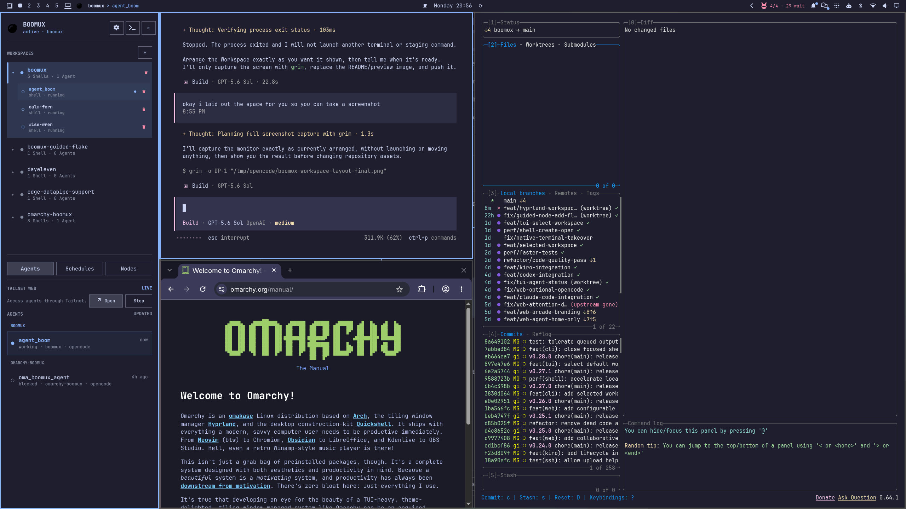

# Boomux

**Persistent Workspaces for native terminal windows.**

Boomux keeps terminal processes running after native terminal windows close. It
groups durable Shells into coordinated Workspaces that can span multiple Nodes
while continuing to use Ghostty, Alacritty, or another XDG terminal as ordinary
native windows.

> [!IMPORTANT]
> The Omarchy side pane shown below is provided by
> [omarchy-boomux](https://github.com/gardnmi/omarchy-boomux). Install both
> projects for that desktop integration. Boomux's CLI and native TUI work
> independently.

<p align="center">
  
</p>

> [!WARNING]
> For scripts, use only commands advertised by `boomux capabilities --json` and
> parse their `boomux.cli/v1` output. Human-readable output is not a compatibility
> contract.

## Quick Start

After [installing Boomux](#install-and-update), run the guided setup:

```console
boomux setup
```

On Omarchy, the recommended core experience installs and enables the
[Boomux plugin](https://github.com/gardnmi/omarchy-boomux), enables coordinated
Workspace presentation in Hyprland, and optionally installs managed keybindings.
Setup asks before each change and restarts Omarchy Shell after plugin changes.
The plugin adds a Boomux icon to the bar and opens a persistent side pane for
Workspaces, Shells, Agents, and Nodes.

- Click the bar icon to open or close the pane.
- With the managed bindings, `Super+B` toggles the pane and `Super+A` toggles
  keyboard focus.
- Use `+` to create a generated local Workspace and first Shell at `$HOME`.
- Use the project-folder button to create a same-named Workspace at a configured
  project path.

`boomux setup` detects supported Agent harnesses, starts the local daemon, and
prompts before installing or replacing integrations and the Boomux Agent Skill.
Prompts default to no, and rerunning setup preserves modified or user-owned
assets unless replacement is explicitly confirmed.

Omarchy's graphical environment must be able to resolve `boomux`; official
release installations use `~/.local/bin`. See the
[plugin README](https://github.com/gardnmi/omarchy-boomux#readme) for its complete
controls and safety behavior. For CLI-only creation, continue to
[Workspace Creation](#workspace-creation).

## Install And Update

### Requirements

- A Unix-like system with an absolute `XDG_RUNTIME_DIR`. Official v1.2.0 binaries
  are available only for x86_64 and aarch64 GNU/Linux.
- `xdg-terminal-exec` and an available terminal desktop entry.

Git is optional for core session persistence; without it, repository metadata is
empty. `boomux doctor` currently reports missing Git as a failed dependency
check. The default desktop Workspace layer additionally requires an active
Hyprland session and compatible `hyprctl`. Outside Hyprland, ordinary Boomux
terminal opens remain native windows.

The release recipe below requires GitHub CLI (`gh`), `sha256sum`, `tar`, and
`install`.

### Latest Release

```console
case "$(uname -s):$(uname -m)" in
  Linux:x86_64) target=x86_64-unknown-linux-gnu ;;
  Linux:aarch64) target=aarch64-unknown-linux-gnu ;;
  *) printf 'unsupported operating system or architecture\n' >&2; exit 1 ;;
esac
version=$(gh release view --repo gardnmi/boomux --json tagName --jq .tagName)
gh release download "$version" --repo gardnmi/boomux \
  --pattern "boomux-$version-$target.tar.gz*"
sha256sum --check "boomux-$version-$target.tar.gz.sha256"
tar -xzf "boomux-$version-$target.tar.gz"
install -Dm755 "boomux-$version-$target/boomux" ~/.local/bin/boomux
~/.local/bin/boomux doctor
```

### Update

Official release binaries installed at `~/.local/bin/boomux` have an explicit
guided updater:

```console
boomux update status
boomux update
boomux doctor
```

The updater verifies the selected GitHub release asset and checksum before
replacing an eligible official installation. Compatible running daemons use
graceful handoff so managed processes and PTYs survive. If the Omarchy companion
plugin is installed, the same confirmation authorizes updating it after Boomux
and reloading it when enabled. Other installation types must be updated through
their original installer. Boomux never silently downgrades or enables automatic
updates.

> [!CAUTION]
> Upgrading from v0.32 to v1.x crosses an incompatible protocol and state
> boundary. It requires a cold upgrade that terminates managed processes. Follow
> the exact [local update procedure](docs/local-update.md#protocol-47-alpha-break).

Prefer `daemon restart` over `daemon stop`: stopping the daemon terminates every
managed process. Upgrade registered remote Nodes separately with
`boomux node upgrade NODE`.

To remove an official release installation, use `boomux uninstall`. Add
`--purge` only when you also intend to remove user data. Use
`boomux node uninstall NODE` for an identity-verified remote uninstall. See
[Uninstall](docs/uninstall.md) for ownership and preservation guarantees.

## Workspace Creation

Create a coordinated Workspace and its first Shell from a project directory:

```console
boomux workspace create my-project --node local --cwd . --open
```

This is the same atomic creation used in the quick start. Use the exact local
Node ID from `boomux node snapshot --json` only if `local` is ambiguous with a
registered alias. In Hyprland, the default desktop adapter places the terminal
in the Workspace's named Boomux special Workspace.

`boomux workspace create my-project` remains the empty-Workspace form. Add its
first Shell later with `boomux shell create my-project --cwd . --open`.

For a simpler current-terminal workflow:

```console
boomux . --name my-project
```

This shorthand creates or reuses a Node-local Workspace and attaches the current
terminal. Node-local Workspaces remain external until adopted or linked, so the
shorthand does not establish a coordinated desktop Workspace by itself. Run it
from a fresh, unmanaged terminal; path-opening shorthand is rejected inside an
existing Boomux Shell.

Open the native dashboard at any time:

```console
boomux ui
```

## Core Concepts

| Term | Meaning |
| --- | --- |
| **Node** | A durable host-local authority with stable identity, independent of the route used to reach it. |
| **Workspace** | A coordinator-owned task grouping whose placements reference exact Node-local Workspaces. It is not an execution location or default Node. |
| **Desktop Workspace Layer** | Optional local presentation of a coordinated Workspace as a Hyprland special Workspace derived from its coordinator ID. It owns no durable resources. |
| **Shell** | A durable Workspace slot with at most one current process run. Each live run owns its PTY; closing its terminal attachment does not close the Shell. |
| **Command** | The dashboard presentation of a Shell whose stored startup argument vector is nonempty. |
| **Launcher** | A durable exact-argument command invoked on every explicit Workspace open or restore. Each invocation is detached, ephemeral, and has no PTY. |
| **Agent Instance** | A durable identity for one external Agent session associated with one Shell run; process exit alone never establishes completion. |
| **Agent Session** | An external conversation projected from Agent Instances or host history. It owns no process, PTY, or lifecycle observation. |

Boomux preserves exact argument vectors and does not add shell interpolation to
launchers or adapters.

## What Persists

| Action | Result |
| --- | --- |
| Close a terminal window or quit the dashboard | Managed Shell runs keep running. |
| Close a Shell | Its current run is terminated and the Shell is removed. |
| Close a Workspace | Its managed Shells terminate and its Launcher definitions are removed; previously launched detached processes are unaffected. Unresolved remote placement removal leaves the Workspace visibly closing for explicit retry. |
| Restart the daemon gracefully | A compatible replacement preserves managed processes through handoff; failure rolls back to the old daemon. |
| Stop the daemon | Every managed process is terminated. |
| Crash or reboot | Managed Shell runs and PTYs are lost. Durable definitions and run history remain; recovered Shells are pending until reopened. Eligible Agent recovery may use the integration's native resume command. |

## Hyprland Workspace Layer

### Desktop Commands

```console
boomux desktop toggle
boomux desktop show <workspace-name-or-id>
boomux desktop next
boomux desktop previous
boomux desktop terminal
boomux desktop close
boomux desktop pop
boomux desktop return
boomux desktop gather
```

`desktop toggle` and `desktop show` navigate without invoking launchers. Use the
following to reveal a layer and perform normal Workspace restore semantics:

```console
boomux workspace open <workspace-name-or-id> --show
```

`desktop close` permanently closes the focused Boomux Shell; outside the Boomux
layer it closes the ordinary active window. `pop`, `return`, and `gather`
rearrange terminal windows without changing Shell ownership.

Use `boomux desktop --help` for command behavior. See
[Architecture](docs/architecture.md) for exact placement and restore invariants.

## Common Workflows

```console
# Select the default coordinated Workspace
boomux workspace select my-project

# Create and open a Shell using that selection
boomux shell create --name dev --cwd . --open

# Change where future local Shells start
boomux workspace set-default-cwd my-project --node local --cwd .

# Store an exact detached launcher
boomux launcher create editor --cwd . -- zeditor .

# Inspect output without attaching
boomux read dev --lines 200

# Close a Shell permanently
boomux shell close dev --workspace my-project
```

Changing a placement default affects future Shell creation only when `--cwd` is
omitted. Existing Shell and Launcher working directories do not change, and new
Launchers do not inherit this default.

`shell create --open` may prepare a terminal while durable creation commits, but
attachment remains gated until creation succeeds. A failed create cannot start a
Shell run.

Use `boomux --help` and `boomux <command> --help` for the complete current CLI.

## Native Dashboard

Run `boomux ui` in a terminal. The dashboard provides four primary views:

- **Workspaces**: coordinated tasks, placement state, attention, and ownership.
- **Agents**: current Agent lifecycle and canonical Sessions.
- **Shells**: durable Shell slots, commands, and exact run state.
- **Nodes**: registration, route health, compatibility, and upgrade actions.

Core keys:

| Keys | Action |
| --- | --- |
| Arrow keys or `h/j/k/l` | Navigate |
| `Tab`, `Shift-Tab`, `1`-`4` | Change view |
| `Enter` | Open or activate the selected item |
| `a`, `e`, `x` | Add, rename/edit, or close/remove where available |
| `/` or `:` | Open the command palette |
| `?` | Help |
| `q` | Quit after pending mutations finish |

Terminal previews are read-only.

## Web Dashboard

Serve the installable Agent dashboard on loopback:

```console
boomux web
```

When OpenCode is available, Boomux also starts OpenCode Web on loopback by
default. Use `--no-opencode-web` to disable it, or `--opencode-web-url URL` to
advertise an existing authenticated server.

Run it detached or inspect/stop it explicitly:

```console
boomux web start
boomux web status
boomux web stop
```

Publish through Tailscale only when intended:

```console
boomux web --tailscale
# or
boomux web start --tailscale
```

> [!WARNING]
> Web-terminal access is equivalent to shell access. OpenCode Web is a separate
> full-control origin. Restrict both to trusted users and configure their access
> boundaries deliberately.

See [Mobile Web](docs/mobile-web.md) for complete security, lifecycle, and
Tailscale behavior.

## Coding-Agent Integrations

Boomux bundles integrations for OpenCode, Pi, Claude Code, Codex, and Kiro CLI.
Inspect and configure one interactively:

```console
boomux integration list
boomux integration setup opencode
boomux integration status opencode
boomux integration verify opencode
```

Restart the coding-agent host after installation when instructed. Integrations
report lifecycle events; they do not infer completion from quiet terminal output
or parse conversations as transcripts. Modified or ineligible host invocations
remain untracked rather than receiving fabricated authority.

Install the vendor-neutral Agent Skill manually when desired:

```console
boomux skill install
```

## Remote Nodes

Add or upgrade a Node through the interactive workflow:

```console
boomux node add
boomux node list
boomux node upgrade <node>
boomux node reauthenticate <node>
```

`boomux node add` verifies the remote identity and requires confirmation before
installing or replacing Boomux. JSON and noninteractive requests never authorize
remote installation.
Forgetting a registration removes only the local route; it does not contact or
delete the remote Node.

Cached remote projections are presentation-only. Mutations require a live,
identity-verified owner connection and are never queued for later.

See [Remote Nodes](docs/remote-nodes.md) for routing, bootstrap, upgrade, and
failure semantics.

## Configuration

Boomux loads the global XDG configuration and optionally overlays the file named
by `BOOMUX_CONFIG`, merging fields individually. Inspect or edit the active
writable layer with:

```console
boomux config path
boomux config validate
boomux config edit
```

`config edit` validates and atomically writes the active local configuration
layer. These commands never mutate remote Node configuration.

Common settings:

```toml
terminal = "Alacritty.desktop"

[projects]
roots = ["~/Projects", "~/Work"]
max_depth = 3

[dashboard]
follow_focused_terminal = true

[desktop]
# Default: "disabled"
# workspace_layer = "hyprland-special"

[recovery]
resume_agents = true
persist_terminal_history = false
```

The Hyprland Workspace layer, desktop and sound notifications, and terminal
history persistence are disabled by default. `boomux setup` offers to enable the
Workspace layer as part of its recommended Omarchy experience. Daemon-owned
settings require `boomux daemon restart`; local desktop presentation settings do
not.

## Security And Privacy

- Daemon sockets and durable stores are restricted to the current user.
- Attachment startup environments are validated but never persisted or projected.
- Persistent terminal history is opt-in and stores bounded plain text.
- Writable web-terminal access is equivalent to shell access.
- Remote projections never authorize offline writes.
- Omarchy plugins and coding-host integrations execute unsandboxed in their host
  processes; review them before installation.

## Compatibility And Automation

```console
boomux --version
boomux capabilities --json
```

Capabilities inspect the installed CLI without starting or contacting the daemon.
They report its version, supported protocol, static features, stable JSON
commands, and validated integration host versions. Use `boomux daemon status`
and Node views for observed runtime compatibility. Supported commands emit the
`boomux.cli/v1` envelope when invoked with `--json`.

The Hyprland layer is local presentation built on coordinated Workspaces. It adds
no compositor identity to durable state, the daemon protocol, or `boomux.cli/v1`.
See [Architecture](docs/architecture.md) and [CLI JSON](docs/cli-json.md) for exact
versions, downgrade behavior, and protocol history.

## Limitations

- Boomux does not preserve a terminal emulator's tabs, panes, or window layout.
- Shells are not containers; they retain the privileges of their owner account.
- Browser terminal control is limited to exact current local Agent runs.
- Official releases currently target x86_64 and aarch64 GNU/Linux desktop
  sessions.

## Further Documentation

- [Architecture](docs/architecture.md)
- [CLI JSON contract](docs/cli-json.md)
- [Local Update](docs/local-update.md)
- [Uninstall](docs/uninstall.md)
- [Remote Nodes](docs/remote-nodes.md)
- [Mobile Web](docs/mobile-web.md)
- [Event Stream](docs/event-stream.md)
- [Live PTY Handoff](docs/live-pty-handoff.md)
- [Lifecycle Validation](docs/lifecycle-validation.md)

## Development

Run the core repository checks:

```console
cargo fmt --all -- --check
cargo clippy --all-targets --all-features --locked -- -D warnings
cargo test --lib --bins --locked -- --test-threads=1
cargo test --test native_backend --locked -- --test-threads=1
bun test integrations/opencode/boomux.test.js integrations/opencode/boomux-tui.test.js integrations/pi/boomux.test.js
```

## License

Boomux is licensed under the [MIT License](LICENSE).
