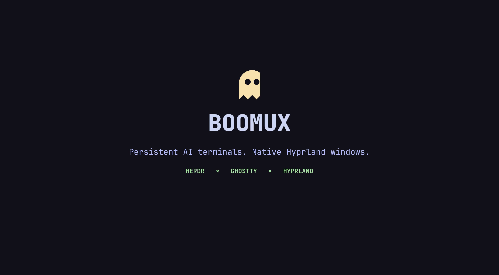

# Boomux

<p align="center">
  
</p>

> [!WARNING]
> **Boomux is under active development.** It is usable today, but installation,
> commands, and workspace behavior may change as the project takes shape.

Boomux presents persistent Herdr terminals as ordinary Ghostty windows. Herdr
owns processes and agent state, Ghostty renders terminals, and the desktop's
existing window manager remains responsible for layout.

## Status

Boomux is an early integration spike. It deliberately composes the public
interfaces of Ghostty and Herdr instead of forking either project.

During development, launch Boomux manually. It will not install or modify any
desktop keybindings; `Super+Enter` remains unchanged unless the user explicitly
opts in later.

Create a terminal in a workspace derived from the directory name:

```console
boomux .
```

Each repeated invocation creates another independent terminal in that
workspace. Relative paths follow normal shell conventions, so `.` means the
current directory. Use `--name` to maintain multiple workspace groups for the
same directory:

```console
boomux .
boomux . --name feature-x
boomux ~/Projects/another-project
```

By default, Boomux attaches the new persistent shell in the invoking terminal.
Use `--new` to leave the invoking shell available and open the persistent shell
in a new native Ghostty window instead:

```console
boomux . --new
boomux . --name feature-x --new
```

Paths must exist and refer to directories. The default workspace name is the
directory's basename.

Run Boomux without a path to restore a workspace:

```console
boomux
```

The Gum picker lists workspace names, Herdr IDs, directories, agent status,
and terminal counts. Selecting a workspace opens every terminal in its own
native Ghostty window.

For a full workspace overview, open the Ratatui dashboard:

```console
boomux ui
```

The dashboard provides workspace and terminal tables, aggregate status cards,
and live Herdr state refreshed four times per second. Use `Tab` to switch focus
between workspaces and terminals, then `j`/`k` or the arrow keys to navigate.

- `Enter` restores every shell in the selected workspace.
- `a` creates a shell, OpenCode, LazyGit, or a custom command.
- `e` renames the selected terminal when the terminal table is focused.
- `x`, then `y`, closes the selected workspace and all of its shells.
- `r` refreshes immediately; `q` or `Esc` quits.

Shell names are stored as Herdr pane labels and appear in the dashboard and
restored Ghostty window titles. New shells receive `BOOMUX_WORKSPACE` and
`BOOMUX_SHELL_NAME` environment variables.

For a dynamic Starship segment that follows later renames, add the hidden prompt
command to your Starship format and configuration:

```toml
format = """...${custom.boomux}..."""

[custom.boomux]
command = "boomux prompt"
when = 'test -n "$HERDR_PANE_ID"'
format = '[ 󰊠 $output](bg:blue fg:yellow)'
```

The dashboard uses the terminal's ANSI palette rather than a hardcoded color
scheme. On Omarchy, Ghostty maps those colors through the active theme, so the
dashboard follows theme changes in the same way as LazyGit.

Restored terminals take over stale writable attachments while keeping their
shell or agent processes running. Closing every Ghostty window leaves the
Herdr-owned workspace and terminals alive for later restoration.

Boomux must be launched from a fresh terminal rather than from inside a
Herdr-managed pane. The picker also hides panes whose foreground process is
another Boomux instance, preventing recursive launcher sessions.

Supporting commands:

```console
boomux ui
boomux doctor
boomux list
boomux open <terminal-id> [--title <title>] [--takeover]
```

## Architecture

```text
Boomux workspace
├── Herdr workspace: durable group identity
├── Herdr tabs/panes: independent persistent terminals
└── Ghostty windows: temporary native clients
```

Closing a Ghostty window ends only its `herdr terminal attach` process. The
server-owned terminal and its child processes continue running in Herdr.

## Technology

- Rust 2024 for a small native executable and alignment with Herdr's ecosystem
- Clap for the CLI
- Ratatui with the Crossterm backend for the dashboard
- Serde for Herdr CLI responses
- Gum for the interactive session chooser
- Ghostty and Herdr as external runtime dependencies

The MVP uses Gum rather than maintaining its own TUI framework, and the Herdr
CLI rather than a custom socket client. Dependencies are added only when a
tested interaction requires them.

## Development

```console
cargo run
cargo run -- .
cargo run -- . --name feature-x
cargo run -- . --new
cargo run -- ui
cargo run -- doctor
cargo run -- list
cargo run -- open <terminal-id>
cargo test
```

## Local Installation

Install the optimized binary after making changes:

```console
cargo install --path . --root ~/.local --force
```

Cargo installs Boomux directly to `~/.local/bin/boomux`, which is already on
this machine's `PATH`. Run `boomux` from any directory.

## Roadmap

See [`docs/roadmap.md`](docs/roadmap.md) for the broader product idea backlog.

1. Aggregate multiple agent states and add attention notifications.
2. Add terminal close and workspace rename operations.
3. Add configurable shell and agent recipes.
4. Use the public socket API only when the CLI stops meeting an actual need.
5. After explicit user approval, add optional desktop keybinding and launcher
   integration outside the core.

## Fork Policy

Do not fork Ghostty or Herdr unless the prototype identifies a missing
capability that cannot be supported through their public interfaces. Boomux
already has the required one-terminal attachment and native-window launch
boundaries. Keeping both projects upstream makes updates and distribution much
simpler.
