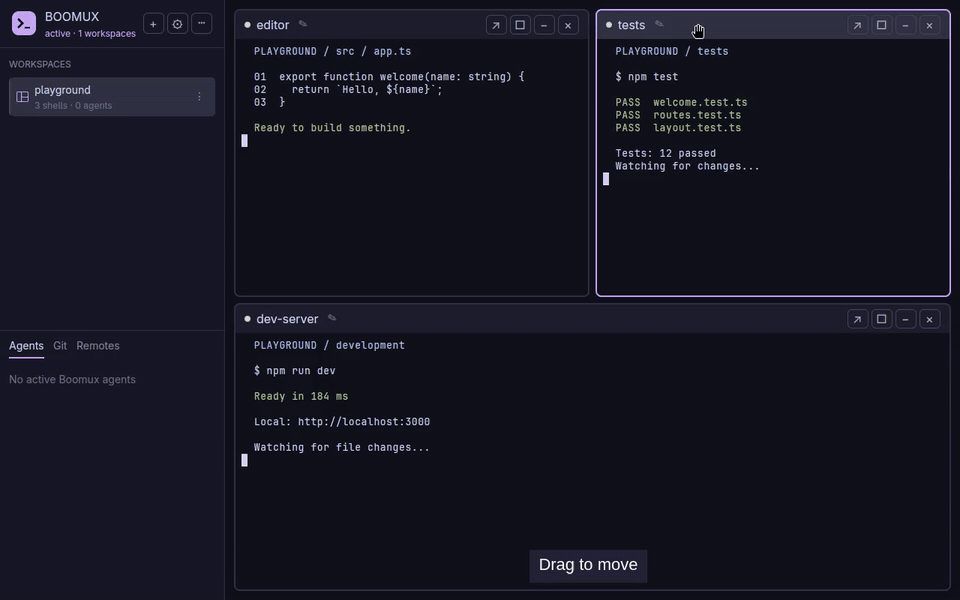

# Boomux

**Hyprland-inspired control for your terminals.**

Drag panes into place, resize your splits, and move around from the keyboard.
Boomux brings your terminals, AI agents, and Git context into one native Linux
workspace—with persistent Shells behind every view.

[Website](https://gardnmi.github.io/boomux/) ·
[Install Desktop](#install) ·
[Desktop guide](desktop/README.md) ·
[Development](DEVELOPMENT.md)



*Real Desktop recording in Tree layout, with fictional demo terminal content.
[Watch the videos](https://gardnmi.github.io/boomux/#in-motion) for playback
controls, or view the [recording notes](website/demos.md).*

## Your Terminals. Your Rules.

- **Move naturally.** Grab a pane by its heading. It follows your pointer, then
  settles into the layout where you drop it.
- **Make room.** Resize from pane edges, switch between tiled and floating panes,
  or expand one pane without losing its place.
- **Stay on the keyboard.** Tap Ctrl + Space to enter layout mode, or hold it for
  a quick adjustment. Navigate, rearrange, and resize without reaching for the mouse.
- **Keep your work running.** Minimize a pane or quit Desktop; its Shell keeps
  running. Come back to the same process.
- **See when you’re needed.** Follow supported coding-agent activity in the
  Agents tab and check repositories, worktrees, and available PR status in Git.
- **Bring remote work closer.** Connect over SSH and open a Remote Workspace.
  Its Shells stay on that machine; manage connections and updates in Remotes.
- **Feel at home.** A native Rust / GPUI-CE interface with Ghostty terminal
  decoding, plus Omarchy theme integration.

The panes live inside Boomux’s own window. Hyprland inspires the interaction,
but is **not required**: Desktop runs on X11 or Wayland. It does not embed
arbitrary desktop applications or replace your window manager.

## Install

Install **Boomux Desktop**, including its matching Boomux CLI:

```sh
curl --proto '=https' --tlsv1.2 -LsSf \
  https://github.com/gardnmi/boomux/releases/latest/download/boomux-installer.sh | sh -s -- --desktop
```

This downloads and runs the official release installer. It verifies the
release-pinned package and checksum, installs without sudo, and adds an
application-menu entry. Review the [installation contract](docs/install.md)
and [release downloads](https://github.com/gardnmi/boomux/releases/latest).

Launch **Boomux Desktop** from your application menu, or run:

```sh
boomux-desktop
```

The launcher starts or reuses the Boomux service automatically. Command links
live in `~/.local/bin`; add that directory to your PATH if your shell does not
already include it. Existing independent CLI installations are preserved.

### Requirements

The current Desktop bundle supports **GNU/Linux x86_64**, glibc **2.39+**, an
X11 or Wayland session, and a working Vulkan driver. Ubuntu 24.04+ and current
Arch are the initial runtime baseline. Desktop bundles for ARM64, macOS,
Windows, and musl/Alpine are not currently provided.

- **Ubuntu/Debian runtime libraries:** `libfontconfig1`, `libwayland-client0`,
  `libx11-6`, `libxcb1`, `libxcb-shape0`, `libxcb-xfixes0`, `libxkbcommon0`,
  `libxkbcommon-x11-0`, and `libvulkan1`, plus your GPU’s Vulkan driver
  (such as `mesa-vulkan-drivers` for supported Mesa GPUs).
- **Arch equivalents:** `fontconfig`, `wayland`, `libx11`, `libxcb`,
  `libxkbcommon`, `libxkbcommon-x11`, `vulkan-icd-loader`, and your GPU’s driver.
- An absolute `XDG_RUNTIME_DIR` for the service.

The installer checks glibc and required graphics libraries; it does not install
system packages. Rust and Zig are only needed for source builds.

> [!NOTE]
> Boomux Desktop is experimental. Its interface and supported feature set are
> still evolving. See the [Desktop guide](desktop/README.md) for current limitations.

## Get Into Your Flow

1. Use **+** to create a Workspace. Configure project folders in Settings to
   open projects quickly from the same menu.
2. Open Shells for your editor, development server, or coding harness.
3. Arrange your panes with the mouse or layout mode.
4. Use **Agents**, **Git**, and **Remotes** in the lower sidebar for context
   without another terminal shuffle.

Choose **Tree** or **Tabs** in Settings. Tabs is the default; the recordings
here use Tree layout.

### Keyboard And Mouse Controls

| Control | Action |
| --- | --- |
| Tap Ctrl + Space | Toggle layout mode |
| Hold Ctrl + Space | Use layout mode temporarily |
| Arrow keys in layout mode | Focus a neighboring pane |
| Shift + Arrow keys in layout mode | Move a pane |
| Alt + Arrow keys in layout mode | Resize a split |
| F in layout mode | Expand the focused pane; press again to return |
| O in layout mode | Toggle a pane between tiled and floating |
| Escape | Leave layout mode |
| Drag a pane heading | Move the pane |
| Drag a pane edge | Resize |
| Ctrl + Alt + B | Show or hide the sidebar |

[Resize demonstration](website/public/demos/resize.gif) ·
[Keyboard demonstration](website/public/demos/keyboard.gif) ·
[Full controls](desktop/README.md)

### Coding Agents, Ready To Go

Boomux bundles integrations for **Claude Code, Codex, OpenCode, Pi, and Kiro CLI**.
The service prepares them automatically on startup, including on remote
machines, and updates unchanged managed integrations with the bundled version.

Your customizations and uninstall choices are preserved. Already-running
harnesses may need restarting to load changes; host-specific approvals such as
Codex hook trust still apply. Boomux does not install the harness applications
themselves or replace their sign-in process.

Integrations report lifecycle events; quiet terminal output or process exit
alone does not establish Agent completion.
See [automatic integration management](docs/install.md#automatic-integration-management)
for opt-outs, customization protection, and troubleshooting.

### Remote Workspaces

Connect a machine from **Remotes**. Boomux uses your OpenSSH configuration and
asks before installing software remotely. Remote Workspaces have a distinct
machine icon, and all their Shells run on that machine.

Expand a machine card to create a **New workspace**, **Update Boomux**, or manage
the connection. **Forget connection only** removes the local registration;
it does not uninstall software or stop remote processes.
**Remove machine & uninstall Boomux** is a separate, confirmed operation.

See [remote-machine behavior](docs/remote-nodes.md) for identity verification,
unavailable machines, and removal guarantees. “Node” remains the underlying
protocol term; Desktop presents machines through Remotes.

## Close The View. Keep The Work.

| Action | What happens |
| --- | --- |
| Minimize a pane or quit Desktop | Its managed Shell keeps running. |
| Explicitly remove a Shell | Its run ends and the Shell is removed. |
| Remove a Workspace | Its managed Shells are terminated as removal is confirmed by their owners. |
| Compatible graceful service restart | Running processes and PTYs survive the handoff. |
| Stop the service | Every managed process is terminated. |
| Crash or reboot | Live processes and PTYs are lost; durable Shell definitions return pending. |

Persistence is not process survival across a reboot. Terminal-history persistence
is opt-in, and pane arrangements and window geometry are not yet saved.
See [lifecycle and ownership](CONTEXT.md) and [live PTY handoff](docs/live-pty-handoff.md).

## Settings And Updates

Use the gear button for appearance, pane layout, notifications, project folders,
and configuration access. Desktop preferences are stored in
`~/.config/boomux-desktop/settings.toml` (respecting `XDG_CONFIG_HOME`).
The service has separate configuration; see the
[configuration architecture](docs/architecture.md).

Desktop offers updates for eligible official bundles. Downloads and restarts
are user-initiated. After an update is prepared, choose **Restart now** or
**Later**; compatible updates use graceful handoff to preserve running terminals.
Older installations may need a one-time migration through their owning updater.

See [Desktop updates and migration](docs/desktop/releases.md#distribution-and-installation)
and [uninstalling](docs/uninstall.md) for ownership and data-preservation details.

## Go Deeper

Use the [documentation guide](docs/README.md) to find the right user guide,
developer reference, or protocol contract.

The included CLI supports automation and a terminal dashboard. Use
`boomux --help` for its current commands. For scripts, use only commands
advertised in `data.json_commands` by `boomux capabilities --json`, invoke them
with `--json`, and parse the `boomux.cli/v1` envelope. Human-readable output
is not a compatibility contract.

- [Desktop guide and limitations](desktop/README.md)
- [Product concepts](CONTEXT.md) and [architecture](docs/architecture.md)
- [CLI JSON contract](docs/cli-json.md) and [event stream](docs/event-stream.md)
- [Integration compatibility evidence](docs/lifecycle-validation.md)
- [Web dashboard and access boundaries](docs/mobile-web.md)
- [Optional Omarchy companion](https://github.com/gardnmi/omarchy-boomux#readme)
- [Security policy](SECURITY.md)

## Security And Privacy

Shells run with their owner’s privileges; they are not containers. Web-terminal
access is shell access, and remote observations never authorize offline writes.
Daemon sockets and durable stores are restricted to the current user. Attachment
startup environments are not persisted, and terminal-history persistence is opt-in.
Harness integrations and optional Omarchy plugins run unsandboxed in their host
processes; review their access accordingly.

## Development

See [DEVELOPMENT.md](DEVELOPMENT.md) for prerequisites, isolated builds, focused
validation, and the contribution workflow.

## License

[MIT](LICENSE). See [Third-Party Notices](THIRD_PARTY_NOTICES.md) for embedded
assets and [dependency policy](deny.toml) for license and advisory checks.
